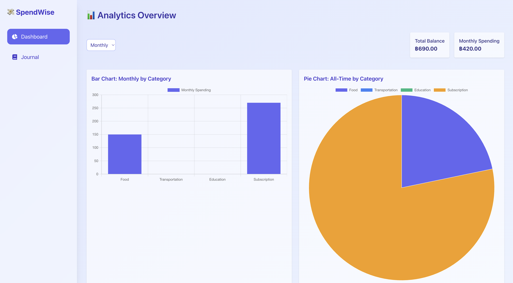
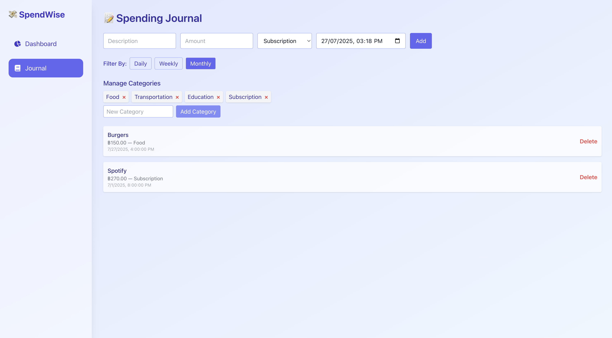

# WAD (Section#542) Project01 - Spending Tracker

## Team Members
- Aung Kaung Myat
- Wai Yan Mya Thaung
- Nyi Thu Hein

## Project Description

**Spending Tracker** is a web-based financial management tool designed to help users track their daily expenses, set personal budgets, and gain insight into their spending habits through interactive visualizations. Built using modern frontend technologies like **React** and **Vite**, the app provides a user-friendly interface for logging expenses, categorizing them, and viewing trends over time.

This project emphasizes:

* Real-time data updates using `localStorage` (with plans for later deployment via GitHub Pages).
* Flexible time-frame analysis (Daily, Weekly, Monthly, and All Time).
* Interactive charts (Bar, Pie, and Line) for visual analytics.
* Responsive design for both desktop and mobile usage.

## Programming Language that we use
 

## 📸 Screenshots

### 📊 Dashboard Page

### 📘 Journal Page

## 🔗 Live Demo

Check out the deployed project here:  
👉 [SpendWise GitHub Pages](https://yano49.github.io/spending_tracker/)
